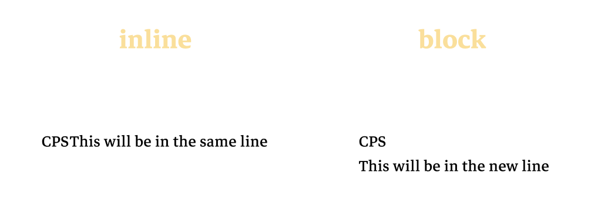
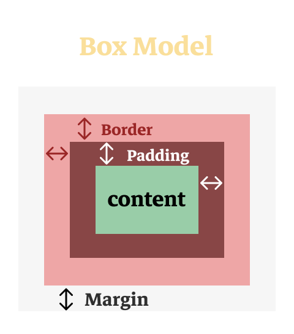
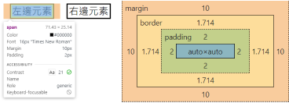

# CSS基礎佈局

在學習實用的佈局技巧之前，我們需要先學習預設的佈局是怎樣的。你有留意到不同的元素是如何排佈的嗎？是由上到下還是左到右？我們將會在這個章節教會你這個觀念！

## 元素的預設佈局

每一種元素都有一個特定的佈局模式，而這種預設的模式主要分了 `inline` 和 `block`。第一種分別是很直接容易理解的， `inline` 元素預設不會霸佔頁面上的一行，也就是說元素不會跑到新的一行裡。

```html
<p>CPS</p><p>This will be in the same line</p>
```

而 `block` 元素預設是會霸佔整行的位置，所以兩個相鄰的 `block` 元素預設是不會在同一行的。
```html
<div>CPS</div>
<div>This will be in the new line</div>
```



## 常見元素的預設佈局

以下的便是常見元素的佈局，除此之外還有很多元素。詳情可以在 [`htmlreference`](https://htmlreference.io/) 選取不同的標籤查看。

```css
display: inline;
/* vs */
display: block;
```


---

## 盒子模型 - Box Model

除了預設佈局外，還有一個非常重要的概念可以幫助我們改變元素的佈局。其實每一個元素在瀏覽器的眼中都是一個盒子，總共分了三層的盒子，最外層：Margin；第二層：Border；第三層：Padding；到最內一層才是我們元素實際內容的大小。



我們可以通過兩個 `<p>` 元素看看效果：

```html
<head>
    <style>
        span {
            border: solid 2px black;
            margin: 10px;
            padding: 2px;
        }
    </style>
</head>

<body>
    <span>左邊元素</span>
    <span>右邊元素</span>
</body>
```

我們可以滑鼠右鍵點擊檢查去打開開發者工具，在 Chrome 的開發者工具中，我們可以查看元素的盒子模型，開發者工具清晰地告訴我們元素盒子模型的數值。



> 在學習的路上，甚至是工作時，我們都會利用開發者工具去進行排查，看看那一個位置出現了問題。所以學習如何使用這個工具也是一個重要的事情。

## 盒子模型常見屬性

基本上所有可視的元素都是使用這個盒子模型，我們只要學會盒子模型就可以控制所有元素的外觀尺寸以及身邊元素的佈局。

```css
/* 我們以 <div> 標籤為例，記住對所有元素都是通用的。 */
div {
    /* 我們可以一次性把多個方向的屬性進行設置 */
    padding: 10px; /* 左右上下都是 10px */
    padding: 10px 20px; /* 上下為 10px，左右為 20px  */
    padding: 1px 2px 3px 4px; /* top: 1px, right: 2px, bottom: 3px, left: 4px */

    /* 我們也可以單獨的設置 */
    padding-top: 10px;
    padding-right: 10px;
    padding-bottom: 10px;
    padding-left: 10px;

    /* 對於 padding，我很常會使用的是以下兩個 */
    padding-inline: 10px; /* left: 10px, right: 10px */
    padding-block: 20px; /* top: 20px, bottom: 20px */
}
```

然後 `margin` 的語法也是跟 `padding` 一模一樣的，只是屬性名稱是 `margin` 而不是 `padding`：

```css
/* 這裡我們以 <span> 標籤為例，記住對所有元素都是通用的。 */
span {
    /* 我們可以一次性把多個方向的屬性進行設置 */
    margin: 10px; /* 左右上下都是 10px */
    margin: 10px 20px; /* 上下為 10px，左右為 20px  */
    margin: 1px 2px 3px 4px; /* top: 1px, right: 2px, bottom: 3px, left: 4px */

    /* 我們也可以單獨的設置 */
    margin-top: 10px;
    margin-right: 10px;
    margin-bottom: 10px;
    margin-left: 10px;

    /* 對於 margin，我很常會使用的是以下兩個 */
    margin-inline: 10px; /* left: 10px, right: 10px */
    margin-block: 20px; /* top: 20px, bottom: 20px */
}
```

## 應該用哪一個？

你應該會很好奇盒子模型有 `margin` 和 `padding`兩個類型調整空間的屬性，但是其實它們兩個的作用是不同的。最主要的分別是關於背景顏色和邊框（`border`）的。我們可以看看以下的代碼：

```html
<style>
    span {
        color: white;
        background-color: #7AC2B1;
        border: solid 1px black;
        padding: 6px 10px;
        margin: 20px;
    }
</style>

<span>工作坊</span>
|
<span>分享會</span>
```

可以看到，背景的顏色只要到邊框就會結束，`padding` 的作用正是增加背景顏色的大小和與邊框的距離；而 `margin`則是控制與附近元素的距離。所以我們要視乎想要什麼效果再去使用。